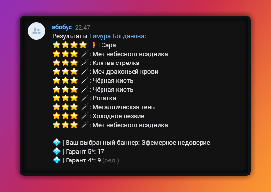

<h1 align="center">Ху Тао - VK Бот с симулятором гачи</h1>

<p align="center">Ху Тао - это <strong>самый лучший</strong> персонаж из одной популярной аниме-игры, а также бот VK с симулятором гачи/молитв оттуда же</p>
<p align="center"></p>

## Реализованные функции
- Полная синхронизация всех предметов из реальной игры, используя её ресурсы
- Очень похожая гача система на гачу систему из игры
- Информация о профиле человеке из игры (используя API [enka.network](https://enka.network/))
- Генерация баннеров
- Поручения
- Ежедневные награды
- Другие развлекательные команды (будет больше в будущем)
- Команды для администраторов

## Команды
### Начало
`!начать` - создание аккаунта в боте

`!помощь` - ссылка на этот список

### Информация
`!персонаж`, `!перс` - показ профиля, количества молитв, примогемов, гаранта и UID

`!баланс` - показ количества молитв и примогемов

`!ник <ник>` - установка никнейма в вашем профиле

`!персонажи`, `!персы` - список полученных персонажей

`!инвентарь`, `!инв` - список полученных оружий

`!персонаж <имя>`, `!перс <имя>` - более подробная информация о вашем полученном персонаже

`!айди <UID>` - установка вашего UID из аниме-игры, что бы о вашем профиле из реальной игры можно было посмотреть информацию

`!геншин инфо`, `!геншин инфо <UID>` - показывает информацию из аниме-игры, используя либо ваш UID, который вы установили раннее, либо другой, если вы его указали в команде

Пример: `!геншин инфо 738723523`

Так же, если у игрока создан аккаунт в боте и указан айди, можно просто написать `!геншин инфо` и ответить на его сообщение

### Баннеры
`!баннеры` - показывает список всех текущих баннеров

`!баннер <название>` - показывает более подробную информацию о выбранном баннере

Пример: `!баннер ивент`, `!баннер ивент 2`, `!баннер оруж`

На данный момент всего есть 5 названий: новичка, ивент, ивент 2, оружейный, стандарт

`!баннер` - показывает ваш выбранный баннер

`!выбрать баннер <название>` - выбирает баннер, на который вы будете молиться

Пример: `!выбрать баннер ивент 2`

`!история` - показывает историю о вашем текущем выбранном баннере (выбрать баннер можно командой выше)

### Молитвы
`!помолиться` - создание молитвы на ваш раннее выбранный баннер (если вы не выбирали баннер, по умолчанию будет баннер новичка)

`!помолиться 10` - то же самое, только 10 раз

`!купить молитвы ивент/стандарт <кол-во>` - покупает указанные молитвы за ваши примогемы, если их хватает

Пример: `!купить молитвы ивент 10`

`!купить молитвы все ивент/стандарт` - покупает молитвы на все примогемы

### Способы заработать примогемы
`!награда` - ежедневная награда, можно получить примогемы, а можно вообще ничего не получить...

`!начать поручения` и `!закончить поручения` - начинает или заканчивает ваше поручения, время поручения зависит от вашего ранга приключений в боте

`!рулетка <кол-во> <цвет>` - казино, в кол-во количество букашек (минимум 50), цвет может быть черный, красный и зеленый

#### Промокоды
`!мой промокод` - вы получите промокод, которым вы можете поделиться с друзьями

`!промокод <промокод>` - если у вас есть промокод, вы можете его ввести сюда. Если это промокод игрока, он получит 4800 примогемов, а тот, кто его ввел, получит 800 примогемов

### Другое
`!рандомная фраза`, `!<кол-во> рандомных фраз` - берет случайную строчку из текст-мапа игры, {NICKNAME} заменяется на F1zzTao, HTML теги убираются, максимум 10 фраз

`!найти фразу <фраза>`, `!найти <кол-во> фраз <фраза>` - ищет строку в текст-мапе игры, в которой присутствует указанная фраза. Так же максимум 10 фраз

`!удалить геншин` - худшая вещь, которую вы можете только сделать

# Запуск бота
**Примечание: если вы обычный пользователь, это, скорее всего, не для вас. В бота можно поиграть в [этой группе](https://vk.com/we_love_hu_tao)**
## Создание базы данных
Нужно создать базу данных с названием `hutao_bot` от пользователя `postgres`.
Сделать это можно через pgadmin или написать в командной строке:
```
createdb hutao_bot
```

После чего надо указать данные базы данных в `pgpass.conf`:
```
<айпи (или localhost)>:<порт>:hutao_bot:postgres:<пароль>
```

Пример:
```
localhost:5432:hutao_bot:postgres:password
```

## Ресурсы
~~Так как бот немного связан с реальной аниме-игрой, он использует её ресурсы. В боте эти ресурсы используются для молитв, инвентаря, списка персонажей, а также для `!геншин инфо`. Эти ресурсы ещё используются для приватных серверов.~~

~~Все необходимые ресурсы можно получить, создав токен на GitLab с разрешением `api`, а также запустив `download_res_win.bat` или `download_res_linux.bat`, в зависимости от вашей ОС. Эти файлы скачивают ресурсы с репозитория [gitlab.com/Dimbreath/AnimeGameData](https://gitlab.com/Dimbreath/AnimeGameData). Если по какой-то причине вы не можете скачать их с помощью этих файлов, можете скачать необходимые ресурсы (вы их можете посмотреть в одном из этих файлов) с этого репозитория.~~

~~Также для баннеров нужен обновленный до последней версии файл `Banners.json`. Обычно я его сам обновляю, но не всегда успеваю, так что возможно вам придется его обновить самим. Такой файл можно найти в дискорде Grasscutter или создать самому. Айди персонажей и оружий можно искать в `AvatarExcelConfigData.json` и `WeaponExcelConfigData.json`, хэш строк с названием баннеров хранится в `ManualTextMapConfigData.json`, а айди этих хэшов выглядет так: `UI_GACHA_SHOW_PANEL_AXXX_TITLE`~~

Обновлено: теперь у бота [свой](https://github.com/we-love-hu-tao/HuTao-Bot/tree/main/bot/resources) формат ресурсов. Они немного похожи на оригинальные ресурсы, только чище и без ненужных строк. Я написал небольшой скрипт, который конвертирует оригинальные ресурсы в ресурсы бота, но ещё не выложил его. Он появится в этой организации чуть позже.
## Запуск
Для запуска бота **необходимо** использовать Python версии **3.10 и выше**. Ниже этой версии не сработает, потому что в боте используется match/case, который был добавлен в 3.10

Необходимые модули и библиотеки можно скачать через файл requirements.txt, `pip install -r requirements.txt`

В `config.py` необходимо указать 4 переменных - `VK_GROUP_TOKEN`, `GROUP_ID`, `VK_USER_TOKEN`, а также `BANNERS_ALBUM_ID`. По желанию можете указать тестовый токен и айди. Если не указывать тестовые переменные, то тогда, если `TEST_MODE` будет равен `True`, бот не сможет запустится (но, возможно, кому-то тестовая группа и не нужна)

В `VK_GROUP_TOKEN` должен быть указан токен группы

В `VK_GROUP_ID` должен быть указан айди группы

В `VK_USER_TOKEN` должен быть указан токен пользователя, у которого есть права на удаление участников из группы, а также права на чтение записи

В `BANNERS_ALBUM_ID` должен быть указан айди альбома, в котором будут картинки баннеров. У пользователя должен быть доступ к этому альбому

Дальше, что бы запустить бота:
- Откройте терминал
- Перейдите в папку с ботом (bot)
- `python main.py`
